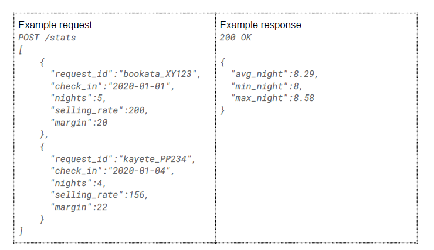
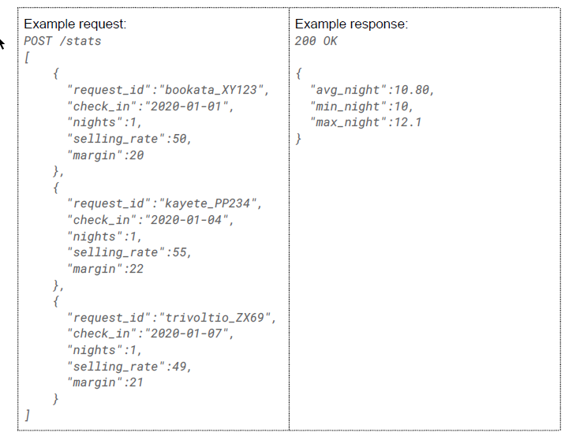
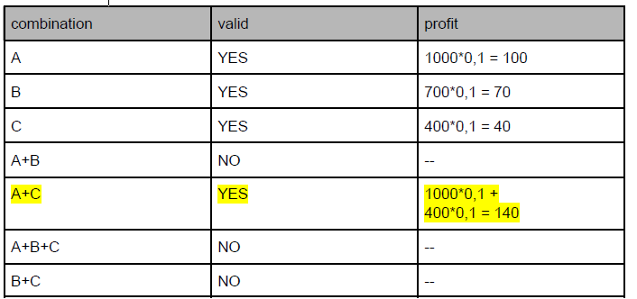
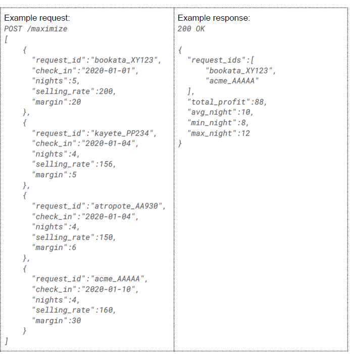

# Booking
Booking challenge

Problem definition
We own an apartment and we’re renting it through different popular websites. Before actually renting the apartment for some days, those platforms send us booking requests. We want to get insights from those booking requests in order to make better decisions. For instance, we’d like to know what’s the profit per night we’re getting and what could be the best combination of bookings to maximize our profits.

We will create an API for this purpose. This API will contain two endpoints; you can find the whole definition here:
https://app.swaggerhub.com/apis-docs/BlackfireSFL/BackendChallenge/1.0.1

**/stats endpoint**

Given a list of booking requests, return the average, minimum, and maximum profit per night taking into account all the booking requests in the payload. The concept “profit per night” follows this calculation:

*(selling_rate * margin (percentage)) / nights*

**/maximize endpoint**

Given a list of booking requests, return the best combination of requests that maximizes total profits.

Acceptance Criteria
-
- Two booking requests cannot overlap in time. For instance, the following requests overlap and cannot be combined. Remember we are renting a single apartment!
  - A: check_in: 2020-01-01; nights: 5 (check out on 2020-01-06)
  - B: check_in: 2020-01-03; nights: 5 (check out on 2020-01-08)
- If more than one combination yields the same maximum profit, return any of them.
- Response fields
  - *request_ids* - list of IDs of the best combination
  - *total_profit* - the total profit of the best combination
  - *avg_night* - the average profit per night of the best combination
  - *min_night* - the minimum profit per night of the best combination
  - *max_night* - the maximum profit per night of the best combination

Detailed example
-
Given this set of booking requests:
- A: check_in: 2018-01-01; nights: 10; selling_rate: 1000€; margin: 10%
- B: check_in: 2018-01-06; nights: 10; selling_rate: 700€; margin: 10%
- C: check_in: 2018-01-12; nights: 10; selling_rate: 400€; margin: 10%

We will choose:

**A+C** is the best combination of bookings that do not overlap and yield the maximum profit.  With the profit being:

A.sellingRate * A.margin + C.sellingRate * C.margin = 1000 * 0,1 400 * 0,1 = 140€

The maxim profit would be: **140€** by combining **A+C**

